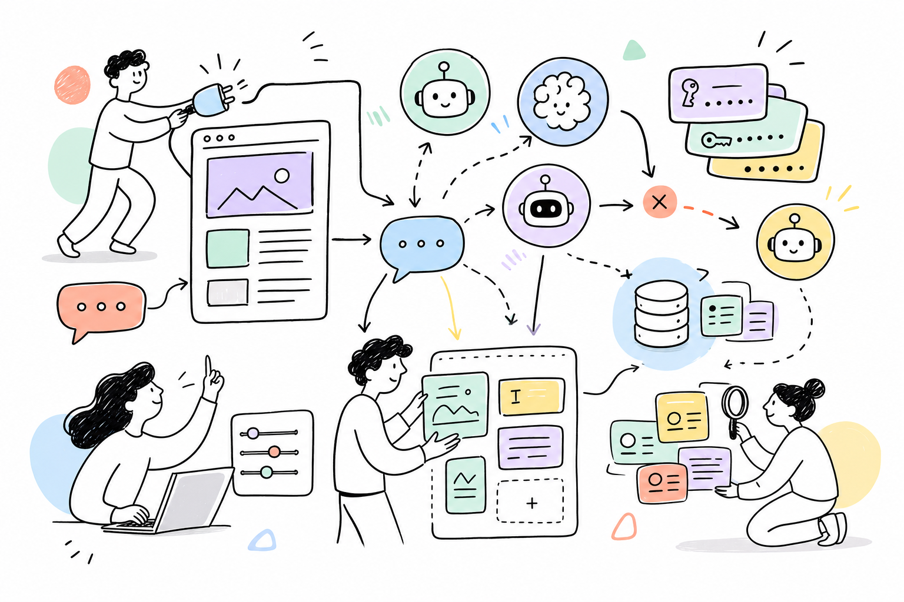

# Squad AI

*Provider-independent AI gateway for ProcessWire — chat, content, embeddings, images and tool-use behind one clean API. (Formerly AiWire.)*



Squad connects your ProcessWire site to every major AI provider through a single, uniform PHP API. Write code once and switch providers (or fall back between them) without changing a line. Keys are stored **encrypted**, never in plaintext config.

> **📖 Full API reference + 25 worked examples → [DOCUMENTATION.md](DOCUMENTATION.md)** · **changes → [CHANGELOG.md](CHANGELOG.md)**

```php
$ai = $modules->get('Squad');
echo $ai->chat('Write a one-line tagline for a dentist in Boston.');
```

---

## Features

- **14 providers, one API** — Anthropic (Claude), OpenAI (GPT), Google (Gemini), xAI (Grok), OpenRouter (400+ models), plus **direct Chinese providers**: DeepSeek, Qwen (Alibaba), Kimi (Moonshot), GLM (Zhipu), MiniMax, Yi (01.AI), Doubao (ByteDance), Ernie (Baidu), Hunyuan (Tencent).
- **Text** — `chat()` / `ask()` with system prompts, multi-turn history, temperature, token limits.
- **Embeddings** — `embed()` for one string or a batch (OpenAI, Google, Qwen, Zhipu). Powers RAG (see the [Atlas](https://github.com/mxmsmnv/Atlas) module).
- **Images** — `image()` for text-to-image (xAI Grok Imagine, OpenAI gpt-image-1 / DALL·E 3).
- **Tool use / agents** — `run()` drives a multi-step tool-calling loop (OpenAI **and** Anthropic tool formats).
- **Automatic fallback** — `askWithFallback()` walks every enabled key, then other providers, until one succeeds.
- **Multiple keys per provider** — enable/disable, default-key selection, one-click connection test in admin.
- **Encrypted key storage** — keys live in a dedicated table, encrypted with libsodium (secret from `config.php`), so a database dump never exposes them. `env:NAME` references are also supported.
- **Prompt caching** — Anthropic prompt caching for large system prompts, automatic for prompts ≥ ~3 KB.
- **Adaptive-model aware** — automatically omits `temperature`/sampling params on models that reject them (Claude Opus 4.7/4.8, Fable/Mythos), so calls don't 400.
- **File cache** — TTL-based response caching (`D`/`W`/`M`/`Y`, custom like `2W`) with optional page scoping.
- **Field storage** — `askAndSave()` / `generate()` write AI copy straight to page fields (skip if already filled).
- **Editable model catalog** — `models.json` + live model refresh (OpenAI/OpenRouter) + per-key custom model IDs.

---

## Requirements

- ProcessWire 3.0.210+
- PHP 8.1+ (with the **sodium** extension for encrypted key storage — bundled in PHP 8)
- cURL extension

---

## Installation

1. Copy into `site/modules/Squad/`.
2. Admin → **Modules → Refresh → Install** “Squad”.
3. Open the module config, add an API key under any provider, click **Test**, **Save All Keys**.
4. Use `$modules->get('Squad')` in your templates/modules.

```
site/modules/Squad/
├── Squad.module.php     # main module + provider catalogue + admin UI
├── SquadProvider.php    # HTTP client for all providers (chat / embed / image / tools)
├── SquadCache.php       # file-based response cache
├── SquadKeys.php        # encrypted key storage (libsodium)
├── models.json          # editable provider/model catalogue
├── README.md · DOCUMENTATION.md · CHANGELOG.md · LICENSE
```

### Where to get keys

| Provider | Console |
|---|---|
| Anthropic | console.anthropic.com |
| OpenAI | platform.openai.com/api-keys |
| Google (Gemini) | aistudio.google.com/apikey |
| xAI | console.x.ai |
| OpenRouter | openrouter.ai/keys |
| DeepSeek / Qwen / Kimi / GLM / MiniMax / Yi / Doubao / Ernie / Hunyuan | each provider's own console (see `models.json` for endpoints) |

---

## Quick start

```php
$ai = $modules->get('Squad');

// 1) Simple text
echo $ai->chat('What is ProcessWire?');

// 2) Full response with metadata
$res = $ai->ask('Explain embeddings in one sentence.', ['maxTokens' => 500]);
if ($res['success']) echo $res['content'];

// 3) Fallback across providers
$res = $ai->askWithFallback('Summarise this…', [
    'provider' => 'anthropic', 'fallbackProviders' => ['openai', 'google'],
]);

// 4) Embeddings (one string or an array → vectors)
$vec  = $ai->embed('hello world')['embedding'];          // [float, …]
$vecs = $ai->embed(['a', 'b', 'c'])['embeddings'];       // [[…], […], […]]

// 5) Image generation
$img = $ai->image('a calm coastal sunrise, photographic', ['aspect' => '16:9']);
echo $img['url'];   // or $img['b64']

// 6) Tool use (agent loop)
$res = $ai->run([
    'message' => 'What is 19 * 23?',
    'tools'   => [['name' => 'multiply', 'description' => 'Multiply two numbers',
        'parameters' => ['type'=>'object','properties'=>['a'=>['type'=>'number'],'b'=>['type'=>'number']],'required'=>['a','b']]]],
    'onTool'  => fn($name, $in) => (string) ($in['a'] * $in['b']),
]);
echo $res['content'];

// 7) Write AI copy into page fields
$ai->generate($page, [
    ['field' => 'summary',  'prompt' => "One-sentence summary of {$page->title}"],
    ['field' => 'body',     'prompt' => "Two paragraphs about {$page->title}"],
], ['cache' => 'M']);
```

---

## API methods

| Method | Returns | Description |
|---|---|---|
| `chat($msg, $opts)` | `string` | Text only, `''` on error |
| `ask($msg, $opts)` | `array` | `success`, `content`, `usage`, `raw`, `cached` |
| `askWithFallback($msg, $opts)` | `array` | Tries all keys/providers until success |
| `askMultiple($msg, $providers)` | `array` | Same prompt to several providers |
| `embed($input, $opts)` | `array` | `embedding` (single) / `embeddings` (batch), `model`, `usage` |
| `image($prompt, $opts)` | `array` | `url` / `b64`, `model`, `provider` |
| `run($opts)` | `array` | Tool-use loop: `content`, `steps`, `messages`, `usage` |
| `generate($page, $blocks, $opts)` | `array` | Multi-block field generation |
| `askAndSave($page, $fields, $msg)` | `array` | Ask + save to field (skip if filled) |
| `saveTo` / `loadFrom` | `bool` / `?string` | Manual field storage |
| `getProvidersStatus()` | `array` | Providers + key status |
| `getDefaultEmbedProvider()` / `getDefaultImageProvider()` | `?string` | First capable provider with a key |
| `clearCache` / `clearAllCache` / `cacheStats` | — | Cache management |

Common `$opts`: `provider`, `model`, `systemPrompt`, `maxTokens`, `temperature`, `history`, `keyIndex`, `cache`, `timeout`. Embeddings/images also accept `provider`/`model`; `image()` takes `aspect`, `resolution`, `size`, `n`.

---

## Security

- **Keys are encrypted at rest.** They are stored in the `squad_keys` table as libsodium ciphertext; the encryption key is derived from a secret in `config.php` (`$config->squadSecret` → `tableSalt` → `userAuthSalt`), never from the database — so a DB dump only ever contains ciphertext. Don't change that salt after storing keys, or they'd need re-entering.
- **`env:` references** — store a key as `env:OPENAI_API_KEY` to read it from an environment variable instead of the database.
- Admin AJAX actions are CSRF-validated; JSON embedded in admin markup is escaped.

---

## License

MIT. Author: **Maxim Semenov** — [smnv.org](https://smnv.org) · built for the [ProcessWire](https://processwire.com/) community.
